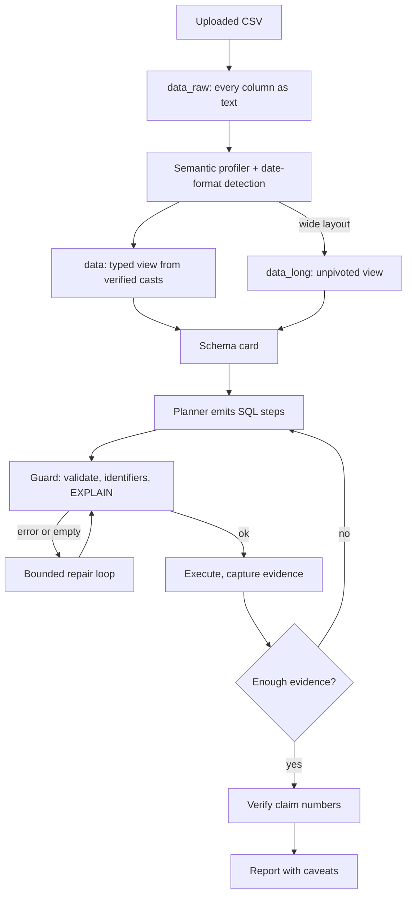

# Autonomous Data Analyst

Upload any CSV, ask a question in plain language, and get an answer where every
figure traces back to the SQL that produced it.

The hard part is not generating SQL — it is not being confidently wrong. This
system is built around two rules: **the LLM never supplies a number**, and
**nothing silently guesses**. Types, date formats and column meanings are
derived from the data and verified, failures degrade into caveats rather than
crashes, and every claim is checked against the evidence it cites.

## Architecture

- **Frontend:** Next.js + TypeScript + Tailwind + Recharts
- **Backend:** FastAPI + LangGraph + DuckDB
- **LLM:** Groq (default), OpenAI or Anthropic, selected by environment variable



### Why the CSV is loaded twice

DuckDB's `read_csv_auto` guesses. Given `1/1/2014` it guessed D/M/YYYY, which
folded a full year of the financial sample into January — and produced clean,
plausible, entirely wrong quarterly comparisons.

So the file is first read with `all_varchar=true` into `data_raw`, where no
inference can happen. The profiler then works on the raw text: it tries
candidate date formats, requires a high parse rate, and resolves an ambiguous
day/month order from the data itself (a component above 12 is decisive;
otherwise it prefers the reading that spreads across the calendar rather than
collapsing into one month). Only then is the typed `data` view created from
cast expressions that were actually verified.

A useful side effect: because `data` is already typed, generated SQL is just
`SUM("Sales")` and `"Date" >= DATE '2014-01-01'`. No casting, no currency
stripping, and a whole category of malformed queries disappears.

### Column roles

Every column is classified as a **measure**, **dimension**, **temporal** value
or **identifier**. That last one matters: `Series ID` (`ABIL148UR`) used to be
stripped to `148` and offered as the default metric. Identifiers are never
aggregated, and integer period keys like `Year` are grouped, not summed.

### Wide CSVs

Files that store each period as a column (the unemployment sample has eighteen
monthly columns) have no date column at all. When date-like headers are
detected, an unpivoted `data_long` view is built alongside `data`, and the
schema card tells the planner which to use.

### Failure handling

| Failure | Response |
| --- | --- |
| Invalid or dangerous SQL | Rejected before execution by the guard |
| Unknown column | `difflib` suggestion fed into the repair prompt |
| Runtime or binder error | Up to three repair attempts, each recorded |
| Query returns zero rows | Treated as a failure and retried once |
| Step still fails | Recorded as a failed finding; the run continues |
| Any node raises | Converted to a `step_error` event and a degraded answer |
| Claim quotes a figure not in its evidence | Confidence downgraded, caveat added |
| Claim backed only by empty results | Dropped from the report |
| Question the data cannot answer | Declined with a clarification, no invented analysis |

## Quick start

### 1. Backend

```bash
cd backend
python3 -m venv .venv
source .venv/bin/activate
pip install -e .
cp .env.example .env
# Edit .env and set GROQ_API_KEY
uvicorn app.main:app --reload --port 8000
```

### 2. Frontend

```bash
cd frontend
cp .env.example .env.local
npm install
npm run dev
```

Open [http://localhost:3000](http://localhost:3000).

### 3. Try it

There are three deliberately different samples in [`sample-data/`](sample-data):

| File | What makes it awkward | Try asking |
| --- | --- | --- |
| `sales.csv` | Tidy and small | *Why did revenue drop in Q3?* |
| `04-01-Financial Sample Data.csv` | Currency strings, padded headers, `CANADA` vs `germany`, M/D/YYYY dates | *Which country was the most profitable in 2014?* |
| `2025-01-01 to 2026-06-01 Unemployment Rate…csv` | Wide layout, an all-empty month, alphanumeric IDs | *What is the average unemployment rate by region?* |

## Environment variables

| Variable | Description |
|----------|-------------|
| `LLM_PROVIDER` | `groq` (default), `openai`, or `anthropic` |
| `GROQ_API_KEY` | Required when provider is groq |
| `GROQ_MODEL` | Default `llama-3.3-70b-versatile` |
| `GROQ_BASE_URL` | Default `https://api.groq.com/openai/v1` |
| `OPENAI_API_KEY` | Required when provider is openai |
| `OPENAI_MODEL` | Default `gpt-4o` |
| `ANTHROPIC_API_KEY` | Required when provider is anthropic |
| `ANTHROPIC_MODEL` | Default Claude Sonnet |
| `DATA_DIR` | Local storage root (default `../data`) |
| `MAX_UPLOAD_MB` | Largest accepted CSV, default 15; also a memory ceiling |
| `CORS_ORIGINS` | Allowed frontend origins, comma-separated |
| `CORS_ORIGIN_REGEX` | Pattern for origins that change per deploy, e.g. Vercel previews |
| `NEXT_PUBLIC_API_URL` | Backend URL for the frontend |

**Never hardcode API keys.** Store them only in `.env` files (gitignored).

## Deployment

The frontend is a client-rendered Next.js app and calls the backend directly
from the browser, so the two halves deploy independently: Vercel for the
frontend, a Render web service for the backend.

### Backend on Render

[`render.yaml`](render.yaml) describes the service, so **New > Blueprint** in
the Render dashboard needs nothing but the repository. Set `GROQ_API_KEY` when
prompted, then check `https://<service>.onrender.com/health`.

Two things about that blueprint are load-bearing:

- **`--workers 1`.** Sessions, SSE queues and the running analysis task all live
  in the in-process `SessionManager` singleton. A second worker would answer
  `/sessions/{id}/stream` for a session it has never heard of.
- **`DATA_DIR=/tmp/data`.** Free instances have no persistent disk, so uploads
  and artifacts survive only until the next restart. The frontend treats a 404
  as "the server restarted" and asks for a fresh upload.

### Frontend on Vercel

Import the repository with **Root Directory** set to `frontend`; Next.js and
`npm ci` are detected from `package-lock.json`. Set `NEXT_PUBLIC_API_URL` to the
Render URL for Production, Preview and Development.

Then point the backend back at it: `CORS_ORIGINS` to the production domain and
`CORS_ORIGIN_REGEX` to the preview pattern, since preview deployments get a new
hostname on every commit.

### Free-tier behaviour worth knowing

- A free instance sleeps after 15 minutes idle and takes about a minute to wake.
  The page pings `/health` on load and shows a waking-up notice rather than
  failing the first upload.
- Sleep is triggered by a lack of *inbound* traffic, and SSE heartbeats are
  outbound only. The page polls the session every five minutes while an analysis
  runs so a long report doesn't get cut off mid-run.
- 512 MB of RAM is the real constraint: every analysis step reloads the whole CSV
  into an in-memory DuckDB, which is why `MAX_UPLOAD_MB` defaults to 15.

## Tests

From `backend/`:

```bash
source .venv/bin/activate
pip install -e ".[dev]"
pytest              # offline, no API key required
pytest -m live      # runs the question bank through a real LLM
```

The offline suite pins every bug listed in [CHECKLIST.md](CHECKLIST.md):
date-format detection, identifier and currency classification, wide-format
unpivoting, guard rejections, the repair loop, claim verification, and the
graph's degraded paths. [`tests/eval/questions.yaml`](backend/tests/eval/questions.yaml)
holds the natural-language bank — nineteen questions across all three datasets,
including ones the data cannot answer.

## API

| Method | Path | Description |
|--------|------|-------------|
| `POST` | `/datasets` | Upload CSV, returns the semantic profile |
| `GET` | `/datasets/{id}` | Dataset profile |
| `POST` | `/sessions` | Create analysis session |
| `POST` | `/sessions/{id}/ask` | Start agent run |
| `POST` | `/sessions/{id}/cancel` | Cancel a running analysis |
| `GET` | `/sessions/{id}/stream` | SSE agent events |
| `GET` | `/sessions/{id}` | Full session + explanation |

### Stream events

`node_start`, `tool_call`, `finding`, `chart`, `claim`, `warning`,
`step_retry`, `step_error`, `explanation`, `report_chunk`, and exactly one
terminal `done` or `error`. `step_error` is a step that failed and was
recorded; `error` ends the run.

## Explainability

The final output is a structured `Explanation`:

- **Summary** — a direct answer
- **Claims** — each citing evidence ids, each with a verification status
- **Evidence** — the exact SQL, result preview, row count and computed metrics
- **Reasoning trace** — built from graph execution, including repair attempts
- **Limitations** — data-quality caveats, unverified figures, steps that failed

Click a claim in the UI to inspect the SQL and rows behind it.
