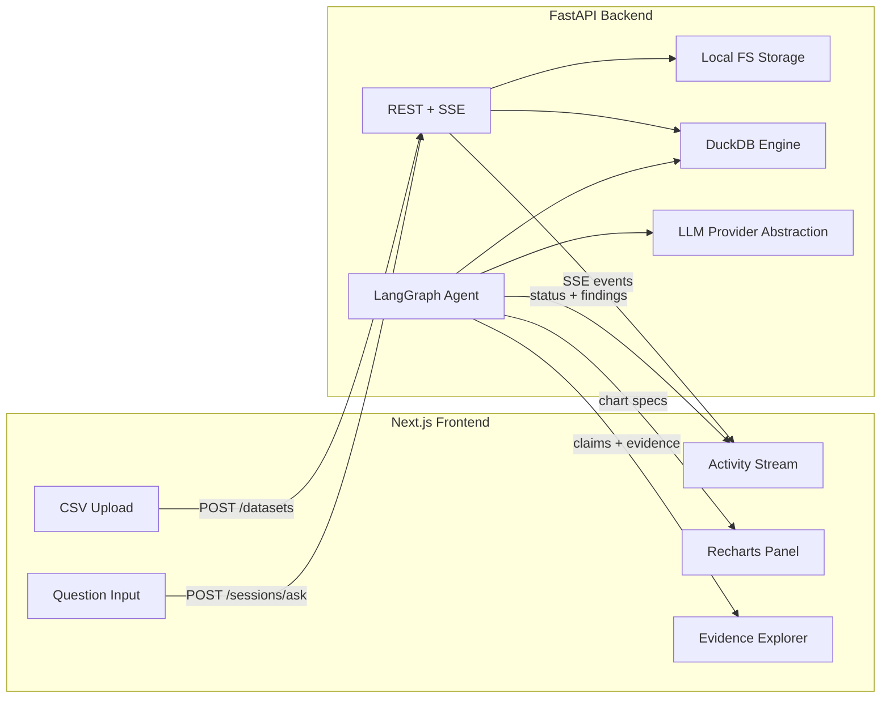
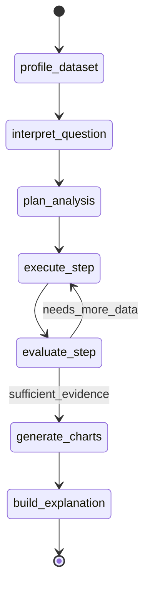
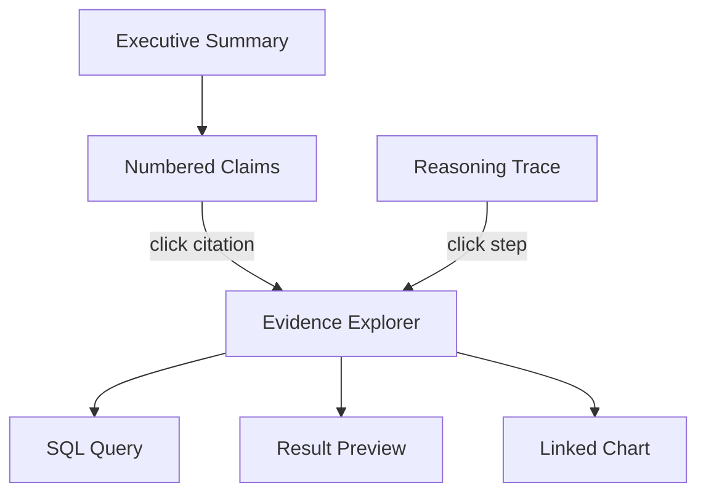

# Autonomous Data Analyst MVP

## Context

Greenfield project at [`data-analyst/`](data-analyst/) (separate from existing `agent-orchestrator`, `ResearchProject`, `SURE`). No FastAPI, LangGraph, or DuckDB code exists today.

## High-Level Architecture



## Project Layout

```
data-analyst/
├── frontend/                 # Next.js 15 + TypeScript + Tailwind
│   ├── app/
│   │   ├── page.tsx          # Upload + analysis workspace
│   │   └── api/              # Optional proxy to backend (CORS)
│   ├── components/
│   │   ├── FileUpload.tsx
│   │   ├── AgentActivityFeed.tsx   # Streaming status
│   │   ├── QuestionInput.tsx
│   │   ├── AnalysisReport.tsx      # Summary + inline citations
│   │   ├── EvidenceExplorer.tsx    # Click citation → SQL + data table
│   │   ├── ReasoningTrace.tsx      # Plan → steps → findings timeline
│   │   └── ChartPanel.tsx          # Recharts renderer
│   └── lib/api.ts
├── backend/
│   ├── app/
│   │   ├── main.py           # FastAPI app
│   │   ├── config.py         # pydantic-settings, env vars
│   │   ├── api/
│   │   │   ├── datasets.py   # upload, profile
│   │   │   └── sessions.py   # ask + SSE stream
│   │   ├── agent/
│   │   │   ├── graph.py      # LangGraph definition
│   │   │   ├── state.py      # Typed AgentState
│   │   │   ├── nodes/        # One file per state
│   │   │   └── tools/        # DuckDB + analysis tools
│   │   ├── llm/
│   │   │   ├── base.py        # LLMProvider protocol
│   │   │   ├── openai.py
│   │   │   └── anthropic.py
│   │   ├── data/
│   │   │   ├── duckdb_engine.py
│   │   │   └── profiler.py
│   │   └── storage/
│   │       └── local.py      # uploads + artifacts
│   ├── pyproject.toml
│   └── .env.example
├── data/                     # gitignored runtime storage
│   ├── uploads/{dataset_id}/
│   └── artifacts/{session_id}/
├── docker-compose.yml        # optional dev convenience
└── README.md
```

## LangGraph Agent Design

The agent uses **explicit states and conditional transitions** — not a single mega-prompt. Each node has a narrow responsibility and emits structured output consumed by the next node.



### AgentState (Pydantic/TypedDict)

Key fields carried across nodes:

- `dataset_id`, `question`, `schema_profile` (columns, types, date columns, numeric columns)
- `interpretation` (metric, time_range, comparison_period, dimensions_of_interest)
- `plan` (ordered list of `AnalysisStep`: goal, tool, params)
- `findings` (list of `Finding`: `{id, step_id, goal, tool, sql, result_rows, result_summary, computed_metrics}`)
- `charts` (list of Recharts-compatible specs, each linked to `finding_id`)
- `explanation` (structured `Explanation` — see Explainability section)
- `messages` (LangGraph message history)
- `events` (for SSE: `{type, node, message, timestamp}`)

### Node Responsibilities

| Node | Type | Purpose |
|------|------|---------|
| `profile_dataset` | Deterministic | Load CSV into DuckDB, compute column stats, detect date/numeric/categorical columns |
| `interpret_question` | LLM | Parse user intent into structured `QuestionInterpretation` (metric, periods, hypothesis type) |
| `plan_analysis` | LLM | Produce 2–5 concrete steps (e.g. "compare Q3 vs Q2 revenue", "break down by region") |
| `execute_step` | Tool | Run current plan step via agent tools; append finding |
| `evaluate_step` | LLM + router | Decide: run another step, replan, or proceed to charts |
| `generate_charts` | LLM + tool | Pick 1–3 chart specs from findings (`create_chart_spec` tool); each chart tagged with `finding_id` |
| `build_explanation` | LLM + deterministic | Produce structured explainable output: claims linked to evidence, reasoning trace, limitations |

**Why this is an agent, not a chatbot:** the LLM never directly answers from memory. It must produce a plan, execute tools, evaluate evidence, and only then synthesize — with a loop for insufficient data. Every conclusion in the final answer must cite specific findings; claims without evidence are rejected by validation.

## Explainability Design

The final output is not free-form prose — it is a structured **`Explanation`** artifact that the UI renders into an inspectable report. Users can answer "why do you say that?" for every claim.

### Core Models ([`backend/app/agent/models/explanation.py`](data-analyst/backend/app/agent/models/explanation.py))

```python
class Evidence(BaseModel):
    id: str                          # e.g. "ev-3"
    finding_id: str                  # links to executed step
    sql: str                         # exact query run
    result_preview: list[dict]       # up to 10 rows shown in UI
    metrics: dict[str, float | str]  # e.g. {"delta_pct": -18.2, "delta_abs": -216000}
    chart_id: str | None             # optional linked chart

class Claim(BaseModel):
    id: str                          # e.g. "c-1"
    text: str                        # "Revenue fell 18% in Q3 vs Q2"
    evidence_ids: list[str]          # must be non-empty
    confidence: Literal["high", "medium", "low"]

class ReasoningStep(BaseModel):
    order: int
    node: str                        # "plan_analysis", "execute_step", etc.
    description: str                 # human-readable step
    output_summary: str

class Explanation(BaseModel):
    summary: str                     # 2–3 sentence executive answer
    claims: list[Claim]              # ordered key conclusions
    evidence: list[Evidence]         # full evidence catalog
    reasoning_trace: list[ReasoningStep]  # how the agent reached the answer
    limitations: list[str]           # assumptions, data gaps, caveats
    markdown: str                    # rendered narrative with [c-1] citation markers
```

### `build_explanation` Node

Two-phase output (deterministic + LLM):

1. **Deterministic assembly** — map each `Finding` to an `Evidence` record (SQL, result preview, computed metrics already captured during `execute_step`)
2. **LLM structured generation** — given all evidence + original question, produce:
   - `summary` (direct answer)
   - `claims[]` where every claim references ≥1 `evidence_id` (enforced by Pydantic validator)
   - `limitations[]` (e.g. "Q3 defined as Jul–Sep; no external market data")
   - `markdown` with inline `[c-N]` citation markers
3. **Validation gate** — reject and retry if any claim lacks evidence, or if a cited evidence ID doesn't exist

### Explainability Rules (enforced in code, not just prompt)

- No claim may appear in the final answer without at least one linked evidence record
- Every evidence record must include the exact SQL that produced it
- Numeric claims must include the computed metric in `Evidence.metrics` (not LLM-estimated)
- `limitations` must mention: time period definitions, missing columns, row filters applied
- Reasoning trace is built automatically from graph execution history (not LLM-generated) for auditability

### Frontend Explainability UI

The report panel has three linked views:

1. **Summary** — executive answer + numbered claims; click `[c-1]` to jump to evidence
2. **Reasoning trace** — collapsible timeline: Question → Interpretation → Plan → Steps → Findings → Conclusions
3. **Evidence explorer** — side panel showing SQL (syntax-highlighted), result table preview, linked chart, and which claims depend on it



### Agent Tools

All tools are Python functions bound to LangGraph; each validates inputs and returns structured JSON.

1. **`get_schema`** — column names, dtypes, null%, sample values (from profiler cache)
2. **`run_sql`** — execute read-only DuckDB SQL against the uploaded table (`SELECT` only, 30s timeout, max 500 rows returned)
3. **`compare_periods`** — parameterized helper: metric column, date column, period A vs B, optional group_by dimension → returns delta table
4. **`top_contributors`** — rank dimension values by contribution to a metric change between two periods
5. **`create_chart_spec`** — emit Recharts JSON (`type`, `data`, `xKey`, `yKey`, `title`) from a finding

SQL safety: regex gate (`^SELECT`), DuckDB read-only mode, no multi-statement, parameterized table name from allowlist.

## Backend API

| Method | Path | Description |
|--------|------|-------------|
| `POST` | `/datasets` | Upload CSV → `{dataset_id, profile}` |
| `GET` | `/datasets/{id}` | Dataset metadata + profile |
| `POST` | `/sessions` | Create session bound to dataset → `{session_id}` |
| `POST` | `/sessions/{id}/ask` | Body: `{question}` → starts LangGraph run |
| `GET` | `/sessions/{id}/stream` | SSE stream of agent events + final report |
| `GET` | `/sessions/{id}` | Full session state (findings, charts, report) |

### SSE Event Types

```json
{"type": "node_start", "node": "plan_analysis", "message": "Planning analysis steps..."}
{"type": "tool_call", "tool": "run_sql", "sql": "SELECT ...", "row_count": 12}
{"type": "finding", "id": "f-2", "summary": "Q3 revenue down 18% vs Q2", "sql": "SELECT ..."}
{"type": "chart", "spec": {...}, "finding_id": "f-2"}
{"type": "claim", "id": "c-1", "text": "...", "evidence_ids": ["ev-2"]}
{"type": "explanation", "summary": "...", "limitations": ["..."]}
{"type": "report_chunk", "content": "..."}
{"type": "done", "session_id": "...", "explanation_id": "..."}
{"type": "error", "message": "..."}
```

Implementation: LangGraph `astream_events` or custom callback handler writing to an async queue consumed by the SSE endpoint.

## LLM Provider Abstraction

[`backend/app/llm/base.py`](data-analyst/backend/app/llm/base.py) defines a protocol:

```python
class LLMProvider(Protocol):
    async def complete(self, messages: list[Message], *, response_format: type[BaseModel] | None) -> str | BaseModel: ...
    async def stream(self, messages: list[Message]) -> AsyncIterator[str]: ...
```

Factory reads env and returns the configured provider:

| Env Var | Purpose |
|---------|---------|
| `LLM_PROVIDER` | `openai` or `anthropic` |
| `OPENAI_API_KEY` | OpenAI key (when provider=openai) |
| `OPENAI_MODEL` | e.g. `gpt-4o` |
| `ANTHROPIC_API_KEY` | Anthropic key (when provider=anthropic) |
| `ANTHROPIC_MODEL` | e.g. `claude-sonnet-4-20250514` |

Use LangChain chat model wrappers (`ChatOpenAI`, `ChatAnthropic`) behind the abstraction so LangGraph integrates cleanly. Structured outputs via Pydantic models for `interpret_question`, `plan_analysis`, and `evaluate_step`.

## Data Layer

- **Upload:** save to `data/uploads/{dataset_id}/data.csv`
- **DuckDB:** in-process connection per request; `CREATE TABLE data AS SELECT * FROM read_csv_auto('...')`
- **Profiler:** pandas `describe()`, null counts, infer date columns (parse sample), store profile as `profile.json` alongside CSV
- **Artifacts:** chart specs, structured `explanation.json`, and rendered `report.md` saved to `data/artifacts/{session_id}/`

No PostgreSQL/SQLite for MVP — session state lives in memory + JSON files on disk (simple dict cache with filesystem persistence on completion).

## Frontend (Next.js)

Single-page workspace at `/`:

1. **Upload zone** — drag-and-drop CSV; shows detected schema (columns, row count)
2. **Question input** — e.g. "Why did revenue drop in Q3?"
3. **Agent activity feed** — live timeline of nodes/tools/findings (SSE consumer)
4. **Explainable report panel** — executive summary, numbered claims with clickable citations, limitations/assumptions section
5. **Evidence explorer** — drill into any claim to see SQL, result preview, and linked chart
6. **Reasoning trace** — collapsible timeline of agent decisions (auto-built from graph execution)
7. **Chart panel** — renders Recharts specs; each chart shows which claim(s) it supports

Tech choices:
- **Recharts** over Plotly (native React, lighter bundle, sufficient for bar/line/area charts)
- **Tailwind** for layout; minimal shadcn-style components (button, card, badge for agent status)
- **`EventSource`** or `fetch` + readable stream for SSE

Env: `NEXT_PUBLIC_API_URL=http://localhost:8000`

## Example Flow: "Why did revenue drop in Q3?"

1. User uploads `sales.csv` (columns: `date`, `revenue`, `region`, `product`)
2. `profile_dataset` detects `date` as temporal, `revenue` as numeric
3. `interpret_question` → `{metric: revenue, period: Q3, comparison: prior_quarter, intent: root_cause}`
4. `plan_analysis` → steps: (a) Q3 vs Q2 total, (b) breakdown by region, (c) breakdown by product
5. `execute_step` runs `compare_periods` and `top_contributors` via DuckDB SQL
6. `evaluate_step` → sufficient; `generate_charts` → bar chart by region, line chart by month
7. `build_explanation` produces:
   - **Summary:** "Revenue fell 18% in Q3, driven primarily by APAC."
   - **Claim [c-1]:** "Total revenue declined 18.2% from Q2 to Q3" → evidence `ev-1` (SQL + `{delta_pct: -18.2}`)
   - **Claim [c-2]:** "APAC accounted for 62% of the decline" → evidence `ev-2` (breakdown SQL + table)
   - **Limitations:** "Q3 = Jul–Sep 2024; analysis limited to uploaded CSV; no seasonality adjustment"
   - User clicks [c-2] → Evidence explorer shows the exact SQL and result rows

## Dev Setup

```bash
# Backend
cd data-analyst/backend
python -m venv .venv && source .venv/bin/activate
pip install -e .
uvicorn app.main:app --reload --port 8000

# Frontend
cd data-analyst/frontend
npm install && npm run dev
```

Provide [`.env.example`](data-analyst/backend/.env.example) documenting all secrets. Add `data/` to `.gitignore`.

## Out of Scope (MVP)

- Multi-file / multi-table joins
- User authentication
- Cloud storage (S3)
- Arbitrary Python code execution by the agent
- Conversation memory across unrelated datasets

## Key Dependencies

**Backend:** `fastapi`, `uvicorn`, `pydantic`, `pydantic-settings`, `langgraph`, `langchain-core`, `langchain-openai`, `langchain-anthropic`, `duckdb`, `pandas`, `numpy`, `python-multipart`, `sse-starlette`

**Frontend:** `next`, `react`, `tailwindcss`, `recharts`, `react-markdown`
